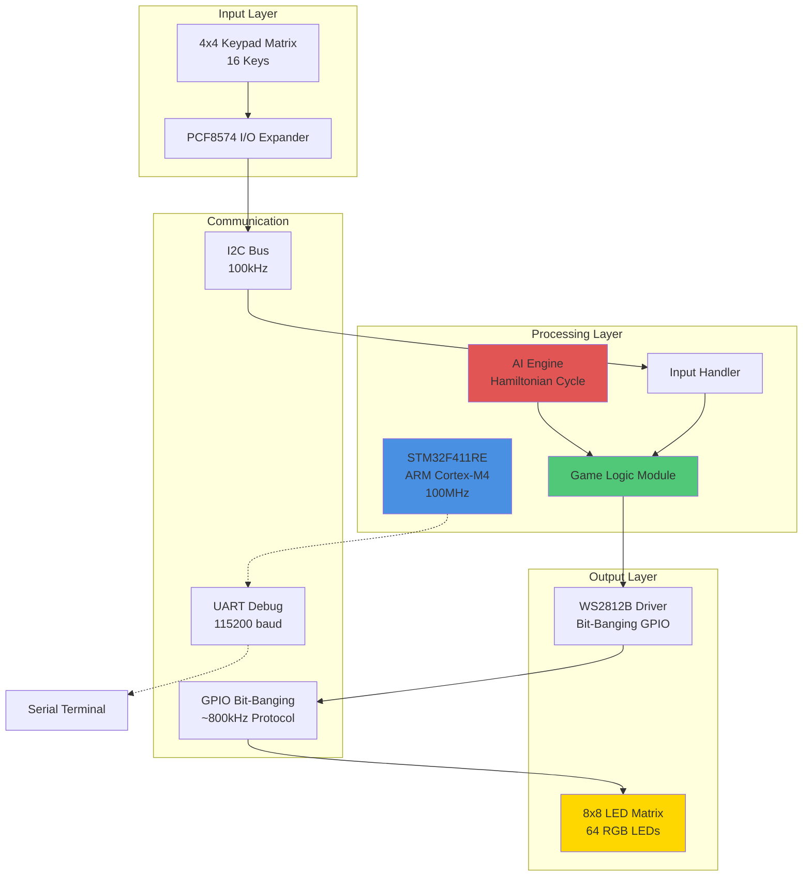
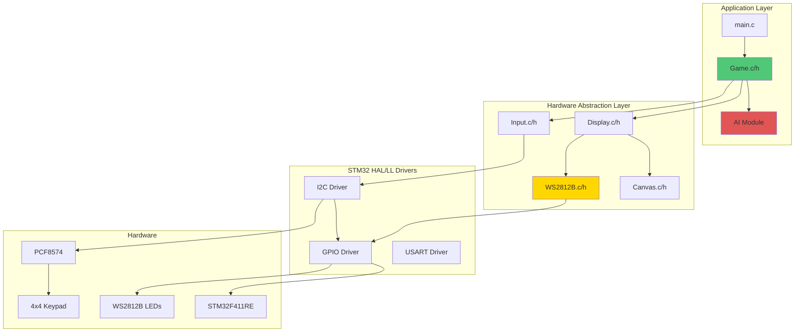
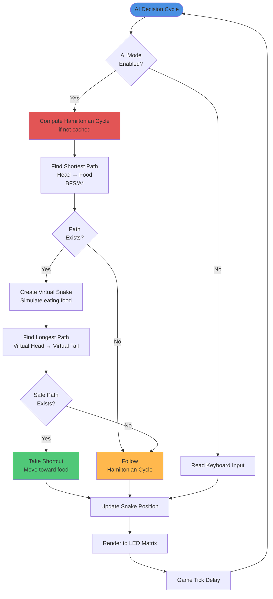
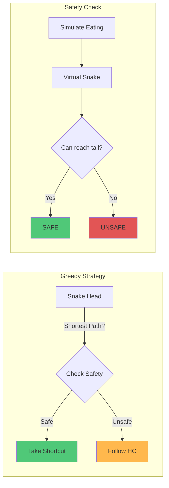
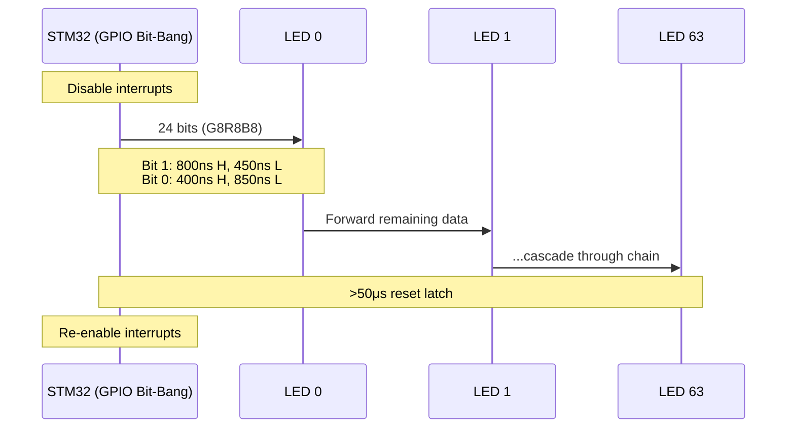

# AI Snake - Embedded Snake Game with Hamiltonian Cycle AI

[](https://www.st.com/en/microcontrollers-microprocessors/stm32f411re.html)
[](https://www.adafruit.com/category/168)
[](https://www.st.com/en/development-tools/stm32cubeide.html)
[](https://en.wikipedia.org/wiki/C_(programming_language))

## Overview

AI Snake is an embedded systems implementation of the classic Snake game running on the STM32F411RE microcontroller. The project features a sophisticated AI agent based on Hamiltonian cycle algorithms with path optimization, enabling autonomous gameplay on an 8x8 WS2812B RGB LED matrix. The system supports both manual control via an 8x8 keyboard matrix and fully autonomous AI-driven gameplay.

The AI implementation uses a combination of Hamiltonian cycle generation and greedy shortest-path optimization to ensure the snake can theoretically achieve a perfect game (filling the entire board) while minimizing the number of moves required.


---

## System Architecture

### High-Level System Overview



### Software Architecture



---

## AI Algorithm Architecture

The AI implementation uses a **Hamiltonian Cycle with Greedy Optimization** approach, combining safety (guaranteed win) with efficiency (minimal moves).

### AI Decision Flow



### Hamiltonian Cycle Generation

The Hamiltonian cycle ensures the snake visits every cell exactly once without collision. The algorithm:

1. **Initialize Graph**: Create a grid graph representing the 8x8 game board
2. **Fix Starting Points**: Set snake's initial head, body positions as fixed vertices
3. **Generate Longest Path**: Use DFS/backtracking to find longest path from head to tail (avoiding body position)
4. **Close the Cycle**: Connect tail back to head, forming a complete Hamiltonian cycle
5. **Cache the Cycle**: Store cycle indices for O(1) lookup during gameplay

### Path Optimization Strategy



**Safety Validation Algorithm:**
```
1. Find shortest path P1: head → food (using BFS)
2. IF P1 exists:
   a. Create virtual snake S2 (copy of current snake)
   b. Move S2 along P1 to eat food (grows by 1)
   c. Find longest path P2: S2.head → S2.tail
   d. IF P2 exists and connects:
      → SAFE: Take first move in P1
   e. ELSE:
      → UNSAFE: Follow Hamiltonian cycle
3. ELSE (no path to food):
   → Follow Hamiltonian cycle
```

---

## Hardware Architecture

### Pin Configuration

| Peripheral | Pin | Function | Configuration |
|------------|-----|----------|---------------|
| **WS2812B** | PB0 | Data Out | GPIO Output (Push-Pull, Very High Speed) |
| **PCF8574** | PB6 | SDA | I2C1_SDA (Open-Drain, Pull-up) |
| **PCF8574** | PB7 | SCL | I2C1_SCL (Open-Drain, Pull-up) |
| **Debug UART** | PA2/PA3 | TX/RX | USART2 (115200 baud) |

### WS2812B LED Control

The WS2812B protocol uses **bit-banging with direct GPIO manipulation** for precise timing control:



**Implementation Details:**
- **Method**: Direct GPIO BSRR register manipulation
- **CPU Clock**: 100MHz (10ns per cycle)
- **Timing Precision**: Cycle-accurate delays with `__NOP()` instructions
- **Critical Section**: All 64 LEDs transmitted with interrupts disabled (~2ms)
- **Color Order**: GRB (not RGB)
- **No Hardware Acceleration**: Pure software bit-banging, no PWM/DMA/Timer

### Keyboard Matrix Scanning

The 4x4 keypad (16 keys) is interfaced via PCF8574 I/O expander to save GPIO pins:

```
PCF8574 Port Mapping:
  P0-P3: Row scan outputs (active LOW)
  P4-P7: Column read inputs (active LOW with pull-ups)

Scanning Algorithm (Keypad.c):
  1. Write row mask: 0xFE, 0xFD, 0xFB, 0xF7 (one row LOW at a time)
  2. Set upper nibble HIGH (0xF0) for column pull-ups
  3. Read column status from upper nibble (bits 4-7)
  4. Decode column: 0x0E→0, 0x0D→1, 0x0B→2, 0x07→3
  5. Calculate key index: key = (3 - row) + (col * 4)
  6. Hardware debouncing via new_key_press flag
```

**Key Mapping (Input.c):**
- S2 → UP
- S10 → DOWN  
- S5 → LEFT
- S7 → RIGHT
- S6 → CONFIRM

---

## Memory and Performance Characteristics

### Memory Footprint

| Component | Flash (ROM) | RAM | Details |
|-----------|-------------|-----|---------|
| **Game Logic** | ~8 KB | ~2 KB | State machine, collision detection |
| **AI Engine** | ~12 KB | ~4 KB | Hamiltonian cycle, path finding |
| **WS2812B Driver** | ~2 KB | ~0.5 KB | Bit-banging (no buffers needed) |
| **Display/Canvas** | ~3 KB | ~0.4 KB | 64 pixels × 3 bytes = 192B × 2 |
| **HAL/LL Drivers** | ~15 KB | ~1 KB | STM32 peripheral drivers |
| **Total** | ~40 KB | ~8 KB | Approx. values |

*STM32F411RE has 512KB Flash, 128KB RAM - plenty of headroom*

### Performance Metrics

- **Game Tick Rate**: ~100-200ms (configurable)
- **AI Decision Time**: <5ms (cached Hamiltonian cycle)
- **LED Refresh Rate**: ~50Hz (20ms per frame)
- **Input Polling Rate**: ~50Hz (20ms debounce period)
- **CPU Utilization**: ~15-20% (mostly idle in delays)

---

## Project Structure

```
AI_Snake/
├── Core/
│   ├── Inc/                      # Header files
│   │   ├── main.h               # Main configuration, #define AI
│   │   ├── Game.h               # Game logic interface
│   │   ├── Display.h            # Display abstraction
│   │   ├── WS2812B.h            # LED driver interface
│   │   ├── Canvas.h             # Framebuffer abstraction
│   │   └── Input.h              # Input handling
│   └── Src/                      # Implementation files
│       ├── main.c               # Entry point, main loop
│       ├── Game.c               # Game state machine
│       ├── Display.c            # Display rendering
│       ├── WS2812B.c            # WS2812B PWM driver
│       ├── Canvas.c             # 8x8 framebuffer operations
│       └── Input.c              # PCF8574 keyboard interface
├── Drivers/                      # STM32 HAL/LL drivers
│   ├── STM32F4xx_HAL_Driver/    # HAL library
│   └── CMSIS/                    # ARM CMSIS core
├── assets/                       # Documentation assets
│   └── Snake_Autoplay.gif       # Demo video
├── led.ioc                       # STM32CubeMX project file
└── README.md                     # Project documentation
```

---

## Technical Implementation Details

### Game State Machine

The game runs on a **frame-based architecture** with separate update rates:

```c
// From Game.h - Rate Definitions
#define REFRESH_RATE 120    // Master loop frequency
#define INPUT_RATE 30       // Input polling (manual mode only)
#define RENDER_RATE 60      // Visual rendering frequency  
#define TICK_RATE 10        // Game logic updates (snake movement)

// Game State Structure (not an enum - uses boolean flag)
typedef struct {
    C_COORDINATES_t body[MAX_SNAKE_LEN];
    uint8_t length;
    key_action_e current_dir;
    C_COORDINATES_t food;
    bool game_over;          // Single flag, not a state machine
    // ...
} GAME_Engine_t;
```

**Main Loop Flow (from main.c):**
```
Every 1000/120 ms (~8.3ms):
  ├─ [Manual Mode Only] Every 4 frames (30Hz): Poll input
  ├─ Every 12 frames (10Hz): 
  │    ├─ Get action (AI or Input)
  │    ├─ GAME_update() - validate and apply direction
  │    └─ GAME_tick() - move snake, check collisions
  ├─ Every 2 frames (60Hz): GAME_render() - draw to canvas buffer
  └─ Every frame (120Hz): 
       ├─ CANVAS_sync() - copy canvas to display buffer
       └─ DISPLAY_update() - push to WS2812B hardware
```

This architecture **decouples rendering from game logic**, ensuring smooth 60 FPS visuals even though the snake only moves at 10 Hz.

### Rendering Pipeline

The system uses a **double-buffered architecture** for flicker-free rendering:

```
Game State → Canvas Buffer → Display Buffer → WS2812B LEDs
            (GAME_render)   (CANVAS_sync)   (DISPLAY_update)
```

**Buffer Flow:**
1. **Canvas Buffer** (`canvas_buffer`): Game draws here with `CANVAS_draw_point()`
2. **Display Buffer** (`display_buffer`): Synchronized copy for hardware output
3. **Brightness Scaling**: Applied in `DISPLAY_update()` before transmission
4. **Color Encoding**: `PIXEL_t` union allows both struct and array access

```c
// From pixel.h - Clever union for GRB access
typedef union {
    PIXEL_GRB_t pixels;     // .pixels.green, .red, .blue
    uint8_t pixel_array[3]; // [0]=G, [1]=R, [2]=B for bit-bang loop
} PIXEL_t;
```

**Rainbow Snake Effect:**
- Snake body uses pre-computed HSV→RGB lookup table (`snake_color_lut[64]`)
- Food uses pulsing white-to-dim gradient (`food_color_lut[20]`)
- All colors gamma-corrected via brightness scaling

### WS2812B Bit-Banging Implementation

This implementation uses **direct GPIO bit-banging** (not PWM+DMA as initially described), optimized for 100MHz CPU:

```c
// Timing in 10ns units (100MHz = 10ns per cycle)
#define T0H_10NS 40   // Logic 0 HIGH: 400ns (40 cycles)
#define T0L_10NS 85   // Logic 0 LOW:  850ns (85 cycles)
#define T1H_10NS 80   // Logic 1 HIGH: 800ns (80 cycles)
#define T1L_10NS 45   // Logic 1 LOW:  450ns (45 cycles)
#define RES_10NS 50000 // Reset pulse: >50μs

// Optimization factor for -Ofast compilation
#define ITTERATION_FACTOR 3

// Bit transmission (WS2812B.c)
static inline void write_bit(WS2812B_t *me, uint32_t high, uint32_t low) {
    me->port->BSRR = me->pin;                  // GPIO HIGH
    delay_cycles(high);                        // Precise delay
    me->port->BSRR = (uint32_t)me->pin << 16;  // GPIO LOW
    delay_cycles(low);
}

// Send 24-bit GRB pixel
void WS2812B_write(WS2812B_t *me, PIXEL_t *pixels, uint16_t count) {
    __disable_irq();  // Critical: no interrupts during transmission
    
    for (uint16_t p = 0; p < count; p++) {
        for (int i = 0; i < 3; i++) {           // G, R, B bytes
            uint8_t byte = pixels[p].pixel_array[i];
            for (int j = 7; j >= 0; j--) {      // MSB first
                if ((byte >> j) & 0x01) {
                    write_bit(me, T1H_10NS/3, T1L_10NS/3);
                } else {
                    write_bit(me, T0H_10NS/3, T0L_10NS/3);
                }
            }
        }
    }
    
    __set_PRIMASK(primask);  // Re-enable interrupts
    WS2812B_reset(me);       // 50μs latch pulse
}
```

**Key Implementation Details:**
- **No DMA/PWM**: Uses direct BSRR register writes for maximum timing precision
- **Interrupts Disabled**: Ensures no jitter during the entire 64-LED transmission (~2ms)
- **Cycle-Accurate Delays**: Calibrated for 100MHz CPU with compiler optimization
- **GRB Color Order**: WS2812B expects Green-Red-Blue, not RGB

### Collision Detection

From `Game.c` - The actual implementation:

```c
void check_collisions(GAME_Engine_t *const me) {
    C_COORDINATES_t head = me->body[0];

    // 1. Wall Collision (uint8_t wrap-around check)
    if (head.x >= DISPLAY_COLS || head.y >= DISPLAY_ROWS) {
        GAME_reset(me);
        return;
    }

    // 2. Self Collision (skip head at index 0)
    for (int i = 1; i < me->length; i++) {
        if (head.x == me->body[i].x && head.y == me->body[i].y) {
            GAME_reset(me);
            return;
        }
    }

    // 3. Food Collision
    if (head.x == me->food.x && head.y == me->food.y) {
        if (me->length < MAX_SNAKE_LEN) {
            me->body[me->length] = me->body[me->length - 1];
            me->length++;  // Grow snake
        }
        spawn_food(me);     // Place new food
    }
}
```

**Key Implementation Notes:**
- Uses `uint8_t` coordinates, so negative values wrap to 255 (caught by `>= 8` check)
- Directly resets game on collision (no return boolean)
- Food collision handled in same function (grows snake)
- Rainbow color LUT for snake body segments

---

## Building and Flashing

### Prerequisites

- **STM32CubeIDE** (v1.10.0 or later)
- **STM32CubeProgrammer** (for standalone flashing)
- **ARM GCC Toolchain** (included with CubeIDE)
- **ST-LINK drivers** (for NUCLEO board)

### Build Instructions

```bash
# Clone repository
git clone https://github.com/Priyanshu0901/AI_Snake.git
cd AI_Snake

# Open in STM32CubeIDE
# File → Open Projects from File System → Select AI_Snake folder

# Build project
# Project → Build All (Ctrl+B)

# Flash to board
# Run → Debug (F11)
```

### Enabling AI Mode

To enable autonomous AI gameplay:

1. Open `Core/Inc/main.h`
2. Add the preprocessor definition:
   ```c
   #define AI
   ```
3. Rebuild the project (`Ctrl+B`)
4. Flash to the board

When AI mode is disabled, the snake is controlled manually via the keyboard matrix.

### Debug Configuration

```
# Serial debug output via UART2 (STLINK VCOM)
Baud Rate: 115200
Data Bits: 8
Stop Bits: 1
Parity: None
Flow Control: None
```

---

## Hardware Bill of Materials (BOM)

| Component | Part Number | Quantity | Approx. Cost |
|-----------|-------------|----------|--------------|
| STM32 Nucleo Board | NUCLEO-F411RE | 1 | $12-15 |
| WS2812B LED Matrix | 8x8 flexible/rigid | 1 | $10-15 |
| I/O Expander | PCF8574 module | 1 | $1-2 |
| Keypad | 4x4 membrane keypad | 1 | $2-5 |
| Power Supply | 5V 2A adapter | 1 | $5-8 |
| Miscellaneous | Wires, breadboard | - | $5-10 |
| **Total** | | | **~$35-55** |

---

## Wiring Diagram

```
STM32F411RE NUCLEO         WS2812B 8x8 Matrix
┌─────────────────┐        ┌──────────────┐
│                 │        │              │
│  PB0 (GPIO)     ├────────┤ DIN          │
│                 │        │              │
│  5V (ext)       ├────────┤ VCC          │
│  GND            ├────────┤ GND          │
└─────────────────┘        └──────────────┘

       STM32F411RE              PCF8574 Module
       ┌─────────────┐         ┌──────────────┐
       │             │         │              │
       │  PB6 (SDA)  ├─────────┤ SDA          │
       │  PB7 (SCL)  ├─────────┤ SCL          │
       │  3.3V       ├─────────┤ VCC          │
       │  GND        ├─────────┤ GND          │
       └─────────────┘         └──────────────┘
                                      │
                              4x4 Membrane Keypad
                               [S1  S2  S3  S4 ]
                               [S5  S6  S7  S8 ]
                               [S9  S10 S11 S12]
                               [S13 S14 S15 S16]
```

**Important Notes:**
- WS2812B requires 5V power supply (external, not from Nucleo)
- PB0 configured as GPIO output (push-pull, very high speed)
- Connect ground of external supply to Nucleo GND
- Total LED current (all white): ~64 LEDs × 60mA = 3.84A (use 5V 5A supply for safety)
- PCF8574 I2C address: 0x20 (default, auto-detected in code)
- **Critical**: LED timing relies on interrupts being disabled during write

---

## Troubleshooting

### LEDs Not Lighting

**Symptom:** No LEDs illuminate or random colors

**Solutions:**
1. Check 5V power supply connection and capacity (>2A recommended)
2. Verify PB0 is configured as GPIO Output (Push-Pull, Very High Speed)
3. Ensure CPU running at 100MHz (check SystemClock_Config)
4. Verify ITTERATION_FACTOR (3) matches compiler optimization (-Ofast)
5. Ensure GND of external supply and Nucleo are connected
6. Check that no high-priority interrupts are enabled during LED write

### AI Not Working

**Symptom:** Snake moves randomly or crashes frequently

**Solutions:**
1. Verify `#define AI` is present in `main.h`
2. Check Hamiltonian cycle generation for 8x8 grid (must have even dimension)
3. Add debug UART output to trace AI decisions
4. Verify pathfinding functions are not timing out

### Keyboard Unresponsive

**Symptom:** No input detected from 4x4 keypad

**Solutions:**
1. Check I2C connections (SDA on PB6, SCL on PB7)
2. Run I2C scanner - PCF8574 should respond at 0x20 (code auto-detects)
3. Verify 4.7kΩ pull-up resistors on I2C lines (or enable internal pull-ups)
4. Check keypad ribbon cable connection to PCF8574
5. Verify row pins (P0-P3) and column pins (P4-P7) in `Keypad.c`
6. Test with multimeter: pressing key should show LOW on corresponding row/col

### Game Running Too Fast/Slow

**Symptom:** Snake moves too quickly or too slowly

**Solution:**
Adjust game tick rate in `Game.h`:
```c
#define TICK_RATE 10  // Snake moves 10 times per second (increase for faster)
```
Or adjust the master refresh rate:
```c
#define REFRESH_RATE 120  // Overall loop frequency
```

---

## Performance Optimization Tips

1. **Pre-compute Hamiltonian Cycle**: Generate once at startup, cache for entire game ✓ (already implemented)
2. **Rainbow Color LUTs**: Pre-compute HSV→RGB conversion ✓ (already implemented)
3. **Compiler Optimization**: Use `-Ofast` flag and calibrate `ITTERATION_FACTOR`
4. **Interrupt Management**: Minimize high-priority interrupts that could disrupt LED timing
5. **Frame Rate Tuning**: Balance REFRESH_RATE vs TICK_RATE for desired gameplay feel

---

## Future Enhancements

- [ ] Add difficulty levels (varying tick rates)
- [ ] Implement multiple AI strategies (greedy, genetic algorithm, neural network)
- [ ] Add sound effects via buzzer/speaker
- [ ] WiFi module integration for multiplayer
- [ ] Persistent high score storage in EEPROM
- [ ] Obstacle mode (walls on the board)
- [ ] Port to larger LED matrices (16x16, 32x32)

---

## References and Further Reading

**Hamiltonian Cycle Algorithms:**
- [Chuyang Liu's Snake AI](https://github.com/chuyangliu/snake) - Path solver and Hamilton solver
- [John Tapsell's Nokia 6110 Snake AI](https://johnflux.com/2015/05/02/nokia-6110-part-3-algorithms/)
- [Perturbed Hamiltonian Cycle Algorithm](https://johnflux.com/tag/snake/)

**STM32 Development:**
- [STM32F411 Reference Manual](https://www.st.com/resource/en/reference_manual/rm0383-stm32f411xce-advanced-armbased-32bit-mcus-stmicroelectronics.pdf)
- [STM32CubeIDE User Guide](https://www.st.com/resource/en/user_manual/um2609-stm32cubeide-user-guide-stmicroelectronics.pdf)

**WS2812B Protocol:**
- [WS2812B Datasheet](https://cdn-shop.adafruit.com/datasheets/WS2812B.pdf)

---

## Acknowledgments

Inspired by classic Snake implementations and modern AI techniques. Special thanks to the embedded systems and AI communities for their contributions to pathfinding and Hamiltonian cycle algorithms.

---

*⭐ If you found this project interesting, please star the repository!*